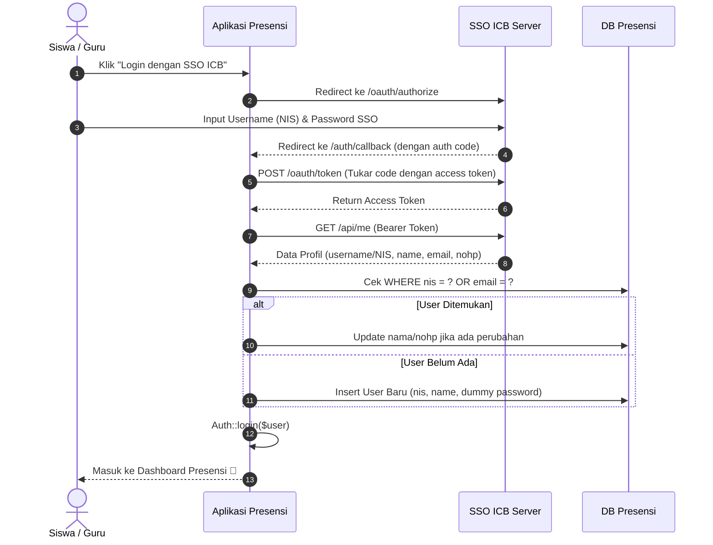

# Panduan Integrasi SSO ICB ke Aplikasi Presensi

Panduan ini berisi langkah-langkah praktis untuk mengintegrasikan **SSO ICB** ke dalam **Aplikasi Presensi** **tanpa perlu mengubah atau membongkar struktur database (`users`)** di aplikasi presensi.

---

## 📌 Catatan Penting Mengenai Database
> **Database Aplikasi Presensi TIDAK PERLU diubah / di-migrate ulang.**  
> Struktur tabel `users` yang sudah ada (dengan kolom `nis`, `kelas_id`, `jurusan_id`, `Point`, `usertype`, dll) akan tetap digunakan 100% apa adanya.  
> Sistem akan mencocokkan user berdasarkan **`nis`** atau **`email`**.

---

## 🚀 Langkah 1: Daftarkan Aplikasi Presensi di SSO Server

1. Buka dashboard admin **SSO ICB** (`http://localhost:8000`).
2. Masuk ke menu **Client Applications** $\rightarrow$ klik **Add New Client**.
3. Isi form:
   - **Application Name**: `Aplikasi Presensi`
   - **Redirect URI**: `http://localhost:8001/auth/callback` *(sesuaikan dengan domain/port aplikasi presensi)*
   - **Status**: `Active`
4. Simpan, lalu catat **Client ID** dan **Client Secret** yang dihasilkan.

---

## ⚙️ Langkah 2: Konfigurasi di Aplikasi Presensi (`.env`)

Buka file `.env` pada **Aplikasi Presensi**, lalu tambahkan konfigurasi berikut di bagian bawah:

```env
# Konfigurasi SSO ICB
SSO_SERVER_URL=http://localhost:8000
SSO_CLIENT_ID=masukkan_client_id_dari_sso
SSO_CLIENT_SECRET=masukkan_client_secret_dari_sso
SSO_REDIRECT_URI=http://localhost:8001/auth/callback
```
*(Sesuaikan port/URL SSO dan Presensi jika berjalan di server/port yang berbeda).*

---

## 🛣️ Langkah 3: Tambahkan Route di Presensi (`routes/web.php`)

Buka file `routes/web.php` pada **Aplikasi Presensi**, kemudian tambahkan:

```php
use App\Http\Controllers\SsoController;

// Route untuk Single Sign-On (SSO)
Route::get('/auth/sso/redirect', [SsoController::class, 'redirect'])->name('sso.redirect');
Route::get('/auth/callback', [SsoController::class, 'callback'])->name('sso.callback');
```

---

## 🎮 Langkah 4: Buat Controller di Presensi (`SsoController.php`)

Jalankan perintah berikut di terminal aplikasi presensi:
```bash
php artisan make:controller SsoController
```

Buka file `app/Http/Controllers/SsoController.php` dan isi dengan kode berikut:

```php
<?php

namespace App\Http\Controllers;

use Illuminate\Http\Request;
use Illuminate\Support\Facades\Http;
use Illuminate\Support\Facades\Auth;
use App\Models\User;
use Illuminate\Support\Str;

class SsoController extends Controller
{
    /**
     * Langkah 1: Arahkan user ke SSO Server untuk otentikasi
     */
    public function redirect(Request $request)
    {
        $request->session()->put('state', $state = Str::random(40));

        $query = http_build_query([
            'client_id'     => env('SSO_CLIENT_ID'),
            'redirect_uri'  => env('SSO_REDIRECT_URI'),
            'response_type' => 'code',
            'scope'         => '',
            'state'         => $state,
        ]);

        return redirect(env('SSO_SERVER_URL') . '/oauth/authorize?' . $query);
    }

    /**
     * Langkah 2: Tangani callback dari SSO, tukar kode dengan token, lalu login
     */
    public function callback(Request $request)
    {
        $state = $request->session()->pull('state');

        // 1. Validasi CSRF state
        if (empty($state) || $state !== $request->state) {
            return redirect('/login')->withErrors(['msg' => 'State mismatch atau sesi telah kedaluwarsa.']);
        }

        // 2. Minta Access Token menggunakan Authorization Code
        $response = Http::asForm()->post(env('SSO_SERVER_URL') . '/oauth/token', [
            'grant_type'    => 'authorization_code',
            'client_id'     => env('SSO_CLIENT_ID'),
            'client_secret' => env('SSO_CLIENT_SECRET'),
            'redirect_uri'  => env('SSO_REDIRECT_URI'),
            'code'          => $request->code,
        ]);

        if ($response->failed()) {
            return redirect('/login')->withErrors(['msg' => 'Gagal mendapatkan token autentikasi dari SSO Server.']);
        }

        $tokenData = $response->json();
        $accessToken = $tokenData['access_token'];

        // 3. Ambil data profil user dari SSO Server
        $userResponse = Http::withHeaders([
            'Accept'        => 'application/json',
            'Authorization' => 'Bearer ' . $accessToken,
        ])->get(env('SSO_SERVER_URL') . '/api/me');

        if ($userResponse->failed()) {
            return redirect('/login')->withErrors(['msg' => 'Gagal mengambil data profil dari SSO Server.']);
        }

        $ssoUser = $userResponse->json();

        // 4. Sinkronisasi dengan Database Presensi
        $nis   = $ssoUser['username'] ?? null;
        $email = $ssoUser['email'] ?? null;

        // Cari apakah user sudah terdaftar di aplikasi presensi berdasarkan NIS atau Email
        $user = User::where('nis', $nis)
            ->when($email, function ($query, $email) {
                return $query->orWhere('email', $email);
            })
            ->first();

        if ($user) {
            // Jika user lama: perbarui data umum saja (tidak mengubah point, kelas, jurusan, riwayat absen)
            $user->update([
                'name'  => $ssoUser['fullname'] ?? $user->name,
                'email' => $email ?? $user->email,
                'nohp'  => $ssoUser['phone'] ?? $user->nohp,
            ]);
        } else {
            // Jika user baru: buat data baru di database presensi
            $user = User::create([
                'name'     => $ssoUser['fullname'] ?? $ssoUser['username'],
                'nis'      => $nis ?? 'SSO-' . Str::random(6),
                'email'    => $email,
                'nohp'     => $ssoUser['phone'] ?? null,
                'password' => bcrypt(Str::random(24)), // Password dummy acak karena login via SSO
                'usertype' => ($ssoUser['role'] === 'admin') ? 'admin' : 'siswa',
                'Point'    => 100,
            ]);
        }

        // 5. Login user ke sesi aplikasi presensi
        Auth::login($user, true);

        return redirect()->intended('/dashboard');
    }
}
```

---

## 🎨 Langkah 5: Tambahkan Tombol Login SSO di View Presensi

Buka halaman login presensi (contoh: `resources/views/auth/login.blade.php`), lalu tambahkan tombol:

```html
<a href="{{ route('sso.redirect') }}" class="btn btn-primary w-100 mt-3" style="display: flex; align-items: center; justify-content: center; gap: 8px;">
    <svg xmlns="http://www.w3.org/2000/svg" width="18" height="18" viewBox="0 0 24 24" fill="none" stroke="currentColor" stroke-width="2" stroke-linecap="round" stroke-linejoin="round"><path d="M15 3h4a2 2 0 0 1 2 2v14a2 2 0 0 1-2 2h-4"/><polyline points="10 17 15 12 10 7"/><line x1="15" y1="12" x2="3" y2="12"/></svg>
    Login dengan SSO ICB
</a>
```

---

## 🔄 Bagaimana Alurnya Bekerja?



---

## ✅ Selesai!
Semua konfigurasi di atas siap diterapkan kapan saja saat Anda melanjutkan pengerjaan integrasi.
